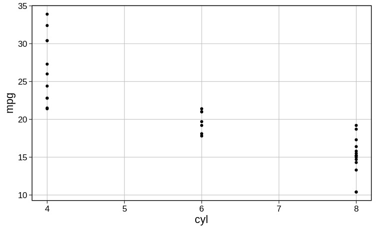

# **tRavis**

### **Description**
Github repository to hold my custom R package, containing a suite of useful
functions.

### **Installation**
The code below installs all dependencies and then tRavis itself.
```r
# tidyverse, devtools, and BiocManager
install.packages(c("tidyverse", "devtools", "BiocManager"))

# DESeq2 using BiocManager
BiocManager::install("DESeq2")

# QoRTs from Github
install.packages("http://hartleys.github.io/QoRTs/QoRTs_STABLE.tar.gz",
                 repos = NULL, 
                 type = "source")

# Finally, you can install tRavis itself
devtools::install_github("travis-m-blimkie/tRavis")

# To update, use the following
devtools::update_packages("tRavis")
```

### **Examples**
Compare two lists:
```r
tr_compare_lists(c(1, 2, 3, 4), c(3, 4, 5, 6))
# > $common
# > [1] 3 4
# > 
# > $unique_x
# > [1] 1 2
# > 
# > $unique_y
# > [1] 5 6
```

<br>

Read in multiple files:
```r
tr_get_files(
  "~/Downloads/new_data", 
  pattern = "de_genes", 
  recur = FALSE, 
  date = TRUE, 
  removeString = "de_genes_"
)
# >                                                       treatment1 
# > "/home/user/Downloads/new_data/de_genes_treatment1_20200224.csv" 
# >                                                       treatment2 
# > "/home/user/Downloads/new_data/de_genes_treatment2_20200224.csv" 
```

<br>

Fisher's test for gene enrichment:
```r
tr_test_enrichment(de_genes, biofilm_genes, total_genes = 5000)
# > 0.00325
```

<br>

Easy themes for [**ggplot2**](https://ggplot2.tidyverse.org/):
```r
# Using tr_theme() with no grid
ggplot(mtcars, aes(cyl, mpg)) + geom_point() + tr_theme()
```


<br>

```r
# Using tr_theme() with grid
ggplot(mtcars, aes(cyl, mpg)) + geom_point() + tr_theme(grid = TRUE)
```


<br>

### **Versioning**
This package makes use of [SemVer](https://semver.org/) for versioning.

<br>

### **Authors**

* Travis Blimkie - Originator an principal contributor

See also the [list of all contributors](https://github.com/travis-m-blimkie/tRavis/graphs/contributors).

<br>

### **License**
This project is written under the MIT license, available [here.](https://github.com/travis-m-blimkie/tRavis/blob/master/LICENSE.md)

<br>
