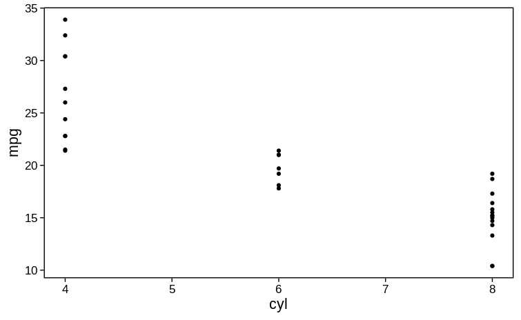
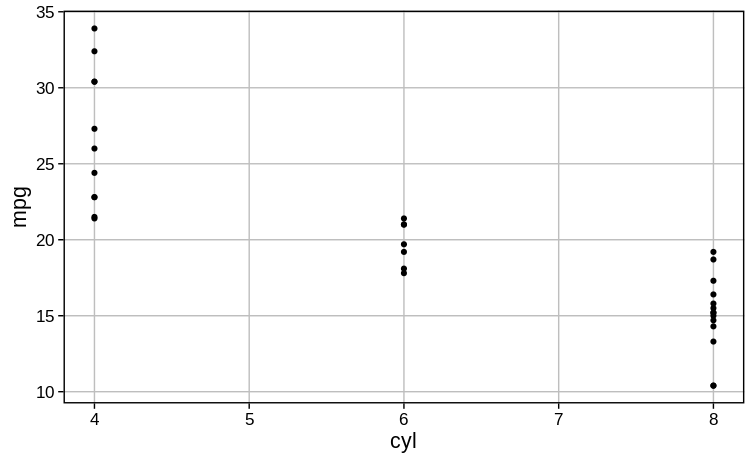

# **tRavis**
Github repository to hold my custom R package, containing a suite of useful
functions.

## **Installation**
Some of the dependencies for tRavis require building from source. If you are
on Windows, you will need to install [Rtools](https://cran.r-project.org/bin/windows/Rtools/) 
before running the code below. 
The code below installs all dependencies and then **tRavis** itself.
```r
# tidyverse, devtools, and BiocManager
install.packages(c("tidyverse", "devtools", "backports", "BiocManager"))

# DESeq2 using BiocManager
BiocManager::install("DESeq2")

# QoRTs from Github
install.packages("http://hartleys.github.io/QoRTs/QoRTs_STABLE.tar.gz",
                 repos = NULL, 
                 type = "source")

# Finally, you can install tRavis
devtools::install_github("travis-m-blimkie/tRavis")
```

<br>

## **Examples**

#### `tr_compare_lists()`
Compare two lists to get the common/unique elements:
```r
tr_compare_lists(c(1, 2, 3, 4), c(3, 4, 5, 6))
# > $common
# > [1] 3 4
# > 
# > $unique_x
# > [1] 1 2
# > 
# > $unique_y
# > [1] 5 6
```

<br>

#### `tr_get_files()`
Create a named list of files, easily piped into `purrr::map(~read.csv(.))` to
create a named list of data frames. Supports recursive searching too!
```r
tr_get_files(
  "~/Downloads/new_data", 
  pattern = "de_genes", 
  recur = FALSE, 
  date = TRUE, 
  removeString = "de_genes_"
)
# >                                                       treatment1 
# > "/home/user/Downloads/new_data/de_genes_treatment1_20200224.csv" 
# >                                                       treatment2 
# > "/home/user/Downloads/new_data/de_genes_treatment2_20200224.csv" 
```

<br>

#### `tr_test_enrichment()`
Fisher's test for gene enrichment, which constructs the matrix for you and
returns the p-value.
```r
tr_test_enrichment(de_genes, biofilm_genes, total_genes = 5000)
# > 0.00325
```

<br>

#### `tr_theme()`
Easy themes for [**ggplot2**](https://ggplot2.tidyverse.org/) that improve on
the default in ways such as increasing font size. You also have the option to 
remove any/all grid elements:
```r
ggplot(mtcars, aes(cyl, mpg)) + geom_point() + tr_theme(grid = FALSE)
```



Or create a nice minimal grid, like so:
```r
ggplot(mtcars, aes(cyl, mpg)) + geom_point() + tr_theme(grid = TRUE)
```


<br>

## **Versioning**
This package makes use of [SemVer](https://semver.org/) for versioning.

<br>

## **Authors**

* Travis Blimkie - Originator and principal contributor

See also the [list of all
contributors](https://github.com/travis-m-blimkie/tRavis/graphs/contributors).

<br>

## **License**
This project is written under the MIT license, available
[here.](https://github.com/travis-m-blimkie/tRavis/blob/master/LICENSE.md)

<br>

## **Acknowledgements**
Thanks to everyone in the lab who has used these functions and provided
ideas/feedback!

<br>
