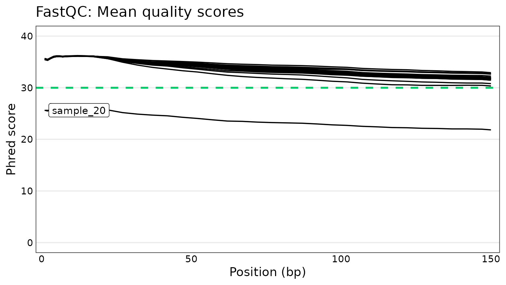
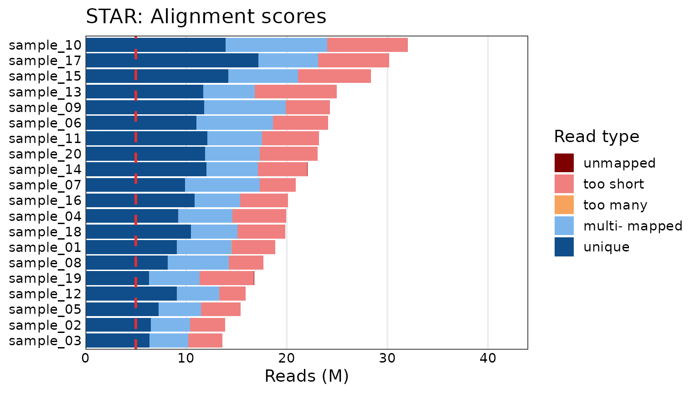

# An overview of tRavis

``` r
library(tRavis)
#> Thanks for using tRavis v1.7.14! If you encounter any bugs
#> or problems, please submit an issue at the Github page:
#> https://github.com/travis-m-blimkie/tRavis/issues
```

## tr_anno_cleaner

Clean annotation files (CSV or TSV) for *Pseudomonas aeruginosa* from
<https://pseudomonas.com>.

``` r
# For this vignette we use a file that comes with the package.
link <- system.file(
  "extdata/Pseudomonas_aeruginosa_PAO1_107.csv.gz",
  package = "tRavis"
)

tr_anno_cleaner(input_file = link)
#> # A tibble: 5,713 × 3
#>    locus_tag gene_name product_name                                  
#>    <chr>     <chr>     <chr>                                         
#>  1 PA0001    dnaA      chromosomal replication initiator protein DnaA
#>  2 PA0002    dnaN      DNA polymerase III, beta chain                
#>  3 PA0003    recF      RecF protein                                  
#>  4 PA0004    gyrB      DNA gyrase subunit B                          
#>  5 PA0005    lptA      lysophosphatidic acid acyltransferase, LptA   
#>  6 PA0006    NA        conserved hypothetical protein                
#>  7 PA0007    NA        hypothetical protein                          
#>  8 PA0008    glyS      glycyl-tRNA synthetase beta chain             
#>  9 PA0009    glyQ      glycyl-tRNA synthetase alpha chain            
#> 10 PA0010    tag       DNA-3-methyladenine glycosidase I             
#> # ℹ 5,703 more rows
```

Or add some extra columns and fill empty names with the corresponding
locus tag.

``` r
tr_anno_cleaner(link, extra_cols = TRUE, fill_names = TRUE)
#> # A tibble: 5,713 × 6
#>    locus_tag gene_name product_name                           start   end strand
#>    <chr>     <chr>     <chr>                                  <dbl> <dbl> <chr> 
#>  1 PA0001    dnaA      chromosomal replication initiator pro…   483  2027 +     
#>  2 PA0002    dnaN      DNA polymerase III, beta chain          2056  3159 +     
#>  3 PA0003    recF      RecF protein                            3169  4278 +     
#>  4 PA0004    gyrB      DNA gyrase subunit B                    4275  6695 +     
#>  5 PA0005    lptA      lysophosphatidic acid acyltransferase…  7018  7791 -     
#>  6 PA0006    PA0006    conserved hypothetical protein          7803  8339 -     
#>  7 PA0007    PA0007    hypothetical protein                    8671 10377 +     
#>  8 PA0008    glyS      glycyl-tRNA synthetase beta chain      10434 12488 -     
#>  9 PA0009    glyQ      glycyl-tRNA synthetase alpha chain     12488 13435 -     
#> 10 PA0010    tag       DNA-3-methyladenine glycosidase I      13540 14091 +     
#> # ℹ 5,703 more rows
```

## tr_clean_deseq2_result

Takes a [DESeq2](https://bioconductor.org/packages/DESeq2/) results
object, and returns the significant DE genes, printing a message
summarizing the comparison and number of significant genes when
`inform = TRUE` (default).

``` r
ex_deseq_results <- readRDS(system.file(
  "extdata",
  "ex_deseq_results.rds",
  package = "tRavis"
))
ex_deseq_results
#> log2 fold change (MLE): condition B vs A 
#> Wald test p-value: condition B vs A 
#> DataFrame with 200 rows and 6 columns
#>          baseMean log2FoldChange     lfcSE      stat      pvalue        padj
#>         <numeric>      <numeric> <numeric> <numeric>   <numeric>   <numeric>
#> gene1      7.1530      -0.636105  0.750697 -0.847352 3.96799e-01 4.95998e-01
#> gene2    108.3659       2.872486  0.357737  8.029601 9.77899e-16 1.62983e-14
#> gene3     25.1923       1.724502  0.643106  2.681522 7.32882e-03 1.62863e-02
#> gene4    110.2302      -1.375727  0.321775 -4.275440 1.90761e-05 7.06521e-05
#> gene5     15.1829      -5.412610  0.819823 -6.602166 4.05195e-11 3.68359e-10
#> ...           ...            ...       ...       ...         ...         ...
#> gene196   1.28627      -0.654713  1.676396 -0.390548 6.96131e-01 7.86589e-01
#> gene197 591.21368       3.285941  0.278768 11.787369 4.53489e-32 4.53489e-30
#> gene198   4.67660       2.434828  0.961683  2.531839 1.13466e-02 2.33951e-02
#> gene199  14.96302      -2.313151  0.491582 -4.705521 2.53218e-06 1.17776e-05
#> gene200  17.69265       1.970386  0.602859  3.268401 1.08157e-03 3.00436e-03
```

``` r
tr_clean_deseq2_result(ex_deseq_results)
#> Found 100 DE genes for condition B vs A.
#> # A tibble: 100 × 7
#>    gene    baseMean log2FoldChange lfcSE   stat   pvalue     padj
#>    <chr>      <dbl>          <dbl> <dbl>  <dbl>    <dbl>    <dbl>
#>  1 gene95     853.            3.35 0.279  12.0  3.26e-33 6.53e-31
#>  2 gene197    591.            3.29 0.279  11.8  4.53e-32 4.53e-30
#>  3 gene180    420.            3.30 0.298  11.1  1.57e-28 1.05e-26
#>  4 gene70     235.           -2.91 0.276 -10.5  5.23e-26 2.62e-24
#>  5 gene106    886.            3.08 0.303  10.1  3.80e-24 1.52e-22
#>  6 gene187     57.3          -4.28 0.428 -10.0  1.42e-23 4.74e-22
#>  7 gene26      93.9           4.62 0.473   9.77 1.47e-22 4.20e-21
#>  8 gene68      72.7          -3.23 0.345  -9.37 7.58e-21 1.90e-19
#>  9 gene122    462.            2.63 0.307   8.58 9.79e-18 2.18e-16
#> 10 gene39     191.            2.67 0.325   8.20 2.33e-16 4.66e-15
#> # ℹ 90 more rows
```

The default filters applied to the data are: `padj < 0.05` and
`abs(log2FoldChange) > log2(1.5)`.

## tr_compare_lists

Compare two lists to find the common/unique elements, with an optional
`names` argument to apply to the results.

``` r
tr_compare_lists(
  x = c(1, 2, 3, 4),
  y = c(3, 4, 5, 6),
  names = c("A", "B")
)
#> $unique_A
#> [1] 1 2
#> 
#> $common
#> [1] 3 4
#> 
#> $unique_B
#> [1] 5 6
```

## tr_get_files

Create a named list of files, easily piped into
`purrr::map(~read.csv(.x))` to generate a named list of data frames.
Supports recursive searching, custom string/pattern removal, and date
removal assuming a format like YYYYMMDD (can’t contain
punctuation/symbols).

``` r
tr_get_files(
  directory = system.file("extdata", package = "tRavis"),
  pattern = "test",
  date = TRUE,
  remove_string = "test_"
)
#> $file1
#> [1] "/home/runner/work/_temp/Library/tRavis/extdata/test_file1_20191231.csv"
#> 
#> $file2
#> [1] "/home/runner/work/_temp/Library/tRavis/extdata/test_file2_20200101.csv"
```

## tr_qc_plots

Generate RNA-Seq QC plots from [MultiQC](https://multiqc.info/) outputs.
Currently only supports summary plots for FastQC (Phred scores and read
counts), STAR, and HTSeq. Plots are created with
[ggplot2](https://ggplot2.tidyverse.org/) for simplicity. A few
arguments are provided to modify the overall font size, set the limits,
and toggle a threshold line at a given number of reads/counts:

``` r
multiqc_data <- system.file("extdata/tr_qc_plots_data", package = "tRavis")
list.files(multiqc_data)
#> [1] "fastqc_per_base_sequence_quality_plot.tsv"
#> [2] "multiqc_fastqc.txt"                       
#> [3] "multiqc_htseq.txt"                        
#> [4] "multiqc_star.txt"

qc_plot_output <- tr_qc_plots(
  directory = multiqc_data,
  threshold_line = 5e6,
  font_size = 14
)

qc_plot_output[["plots"]]
#> $phred_scores
#> 
#> $fastqc_reads
#> 
#> $star
#> 
#> $htseq
```



### Alternate boxplots

The bar plots work well enough for relatively few samples, but quickly
become unwieldy with lots of samples. Box plots can also be generated
using the same function as follows:

``` r
qc_plot_output_box <- tr_qc_plots(
  directory = multiqc_data,
  type = "box",
  threshold_line = 5e6,
  font_size = 16
)

qc_plot_output_box[["plots"]][c("fastqc_reads", "star", "htseq")]
#> $fastqc_reads
#> 
#> $star
#> 
#> $htseq
```


The points can be toggled on or off using the `add_points` argument.

### Data

All the underlying tidy data is also returned, so one can easily
generate their own plots or further examine the data as desired:

- Phred scores
- FastQC reads
- STAR
- HTSeq

``` r
qc_plot_output[["data"]][["phred_scores"]]
#> # A tibble: 760 × 3
#>    sample    position phred_score
#>    <chr>        <int>       <dbl>
#>  1 sample_01        1        35.5
#>  2 sample_02        1        35.5
#>  3 sample_03        1        35.5
#>  4 sample_04        1        35.5
#>  5 sample_05        1        35.5
#>  6 sample_06        1        35.5
#>  7 sample_07        1        35.5
#>  8 sample_08        1        35.5
#>  9 sample_09        1        35.5
#> 10 sample_10        1        35.6
#> # ℹ 750 more rows
```

``` r
qc_plot_output[["data"]][["fastqc_reads"]]
#> # A tibble: 20 × 2
#>    Samples   total_sequences
#>    <fct>               <int>
#>  1 sample_03        13594187
#>  2 sample_02        13886968
#>  3 sample_05        15425132
#>  4 sample_12        15924693
#>  5 sample_19        16755564
#>  6 sample_08        17695634
#>  7 sample_01        18862107
#>  8 sample_18        19868747
#>  9 sample_04        19947789
#> 10 sample_16        20149933
#> 11 sample_07        20899874
#> 12 sample_14        22055477
#> 13 sample_20        23088169
#> 14 sample_11        23204823
#> 15 sample_06        24132864
#> 16 sample_09        24302774
#> 17 sample_13        24985713
#> 18 sample_15        28391398
#> 19 sample_17        30181485
#> 20 sample_10        32058450
```

``` r
qc_plot_output[["data"]][["star"]]
#> # A tibble: 100 × 3
#>    Samples   read_type   n_reads
#>    <fct>     <fct>         <int>
#>  1 sample_03 unique      6352702
#>  2 sample_03 multimapped 3876206
#>  3 sample_03 too many       2908
#>  4 sample_03 too short   3354213
#>  5 sample_03 unmapped       8158
#>  6 sample_02 unique      6489051
#>  7 sample_02 multimapped 3880477
#>  8 sample_02 too many       2416
#>  9 sample_02 too short   3509469
#> 10 sample_02 unmapped       5555
#> # ℹ 90 more rows
```

``` r
qc_plot_output[["data"]][["htseq"]]
#> # A tibble: 100 × 3
#>    Samples   read_type  n_reads
#>    <fct>     <fct>        <int>
#>  1 sample_03 assigned   4724190
#>  2 sample_03 ambiguous  1228684
#>  3 sample_03 not unique 3876206
#>  4 sample_03 no feature  399828
#>  5 sample_03 low aQual        0
#>  6 sample_02 assigned   4831854
#>  7 sample_02 ambiguous  1243270
#>  8 sample_02 not unique 3880477
#>  9 sample_02 no feature  413927
#> 10 sample_02 low aQual        0
#> # ℹ 90 more rows
```

## tr_sort_alphanum

Sort a column of alphanumeric strings in (non-binary) numerical order
given an input data frame and desired column. You can use the column
name or index, and its compatible with pipes.

``` r
df_unsorted <- data.frame(
  colA = c("a11", "a1", "b1", "a2"),
  colB = c(3, 1, 4, 2)
)

tr_sort_alphanum(input_df = df_unsorted, sort_col = "colA")
#>   colA colB
#> 2   a1    1
#> 4   a2    2
#> 1  a11    3
#> 3   b1    4
```

## tr_test_enrichment

Simple wrapper around Fisher’s test for gene enrichment, which
constructs the matrix for you and returns the p value.

``` r
all_genes <- paste0("gene", sample(1:10000, 5000))
de_genes <- sample(all_genes, 1500)
gene_set <- sample(all_genes, 100)

tr_test_enrichment(
  query_set = de_genes,
  enrichment_set = gene_set,
  total_genes = 5000
)
#> [1] 0.05127792
```

## tr_theme

Clean themes for [ggplot2](https://ggplot2.tidyverse.org/) that improve
on the default by increasing font size, changing the background to
white, and adding a border. By default it uses a minimal grid, but you
can easily remove the grid entirely.

``` r
library(ggplot2)
basic_box_plot <- ggplot(mtcars, aes(as.factor(cyl), mpg)) + geom_boxplot()

basic_box_plot + tr_theme()
basic_box_plot + tr_theme(grid = "none")
```


## tr_tidy_gage

Combines the items “greater” and “less” from the list output by
[gage](https://bioconductor.org/packages/gage/) into a single tidy data
frame (tibble), and provides an option to filter the results based on q
value.

``` r
tibble_head <- function(x) {
  head(dplyr::as_tibble(x, rownames = "rownames"))
}

gage_untidy <-
  readRDS(system.file("extdata", "ex_gage_results.rds", package = "tRavis"))

# Have a look at the original results
lapply(gage_untidy, tibble_head)
#> $greater
#> # A tibble: 6 × 7
#>   rownames                      p.geomean stat.mean  p.val q.val set.size   exp1
#>   <chr>                             <dbl>     <dbl>  <dbl> <dbl>    <dbl>  <dbl>
#> 1 pae00470 D-Amino acid metabo…    0.0630     1.61  0.0630 0.924       10 0.0630
#> 2 pae01232 Nucleotide metaboli…    0.111      1.24  0.111  0.924       16 0.111 
#> 3 pae00640 Propanoate metaboli…    0.167      0.994 0.167  0.924       11 0.167 
#> 4 pae00330 Arginine and prolin…    0.179      0.937 0.179  0.924       14 0.179 
#> 5 pae03010 Ribosome                0.197      0.862 0.197  0.924       19 0.197 
#> 6 pae01210 2-Oxocarboxylic aci…    0.250      0.684 0.250  0.924       12 0.250 
#> 
#> $less
#> # A tibble: 6 × 7
#>   rownames                      p.geomean stat.mean  p.val q.val set.size   exp1
#>   <chr>                             <dbl>     <dbl>  <dbl> <dbl>    <dbl>  <dbl>
#> 1 pae00650 Butanoate metabolism    0.0764    -1.48  0.0764 0.680       13 0.0764
#> 2 pae01230 Biosynthesis of ami…    0.0773    -1.44  0.0773 0.680       45 0.0773
#> 3 pae00260 Glycine, serine and…    0.0877    -1.39  0.0877 0.680       16 0.0877
#> 4 pae01100 Metabolic pathways      0.0973    -1.30  0.0973 0.680      269 0.0973
#> 5 pae00630 Glyoxylate and dica…    0.118     -1.23  0.118  0.680       11 0.118 
#> 6 pae01120 Microbial metabolis…    0.160     -0.999 0.160  0.680       77 0.160 
#> 
#> $stats
#> # A tibble: 6 × 3
#>   rownames                                 stat.mean  exp1
#>   <chr>                                        <dbl> <dbl>
#> 1 pae00470 D-Amino acid metabolism             1.61  1.61 
#> 2 pae01232 Nucleotide metabolism               1.24  1.24 
#> 3 pae00640 Propanoate metabolism               0.994 0.994
#> 4 pae00330 Arginine and proline metabolism     0.937 0.937
#> 5 pae03010 Ribosome                            0.862 0.862
#> 6 pae01210 2-Oxocarboxylic acid metabolism     0.684 0.684

tr_tidy_gage(gage_untidy, qval = 1)
#> # A tibble: 70 × 7
#>    pathway                      p_geomean stat_mean  p_val q_val set_size   exp1
#>    <chr>                            <dbl>     <dbl>  <dbl> <dbl>    <dbl>  <dbl>
#>  1 pae00470 D-Amino acid metab…    0.0630     1.61  0.0630 0.924       10 0.0630
#>  2 pae01232 Nucleotide metabol…    0.111      1.24  0.111  0.924       16 0.111 
#>  3 pae00640 Propanoate metabol…    0.167      0.994 0.167  0.924       11 0.167 
#>  4 pae00330 Arginine and proli…    0.179      0.937 0.179  0.924       14 0.179 
#>  5 pae03010 Ribosome               0.197      0.862 0.197  0.924       19 0.197 
#>  6 pae01210 2-Oxocarboxylic ac…    0.250      0.684 0.250  0.924       12 0.250 
#>  7 pae02040 Flagellar assembly     0.267      0.635 0.267  0.924       11 0.267 
#>  8 pae00620 Pyruvate metabolism    0.302      0.526 0.302  0.924       13 0.302 
#>  9 pae02024 Quorum sensing         0.327      0.452 0.327  0.924       29 0.327 
#> 10 pae00405 Phenazine biosynth…    0.367      0.345 0.367  0.924       10 0.367 
#> # ℹ 60 more rows
```

## tr_trunc_neatly

Simple function to truncate long strings without breaking them in the
middle of a word. Useful for trimming long axis labels in a plot.

``` r
tr_trunc_neatly(
  x = "This is a long string that we want to break neatly",
  l = 40
)
#> [1] "This is a long string that we want to..."
```

It’s can also be used inside of a `mutate` call:

``` r
ex_df <- data.frame(
  col1 = c(1, 2, 3),
  col2 = c(
    "This is a pretty long string",
    "This string is actually a bit longer",
    "Here is the longest string of them all, just!"
  )
)
dplyr::mutate(
  ex_df,
  col3 = purrr::map_chr(col2, ~tr_trunc_neatly(.x, l = 20))
)
#>   col1                                          col2                   col3
#> 1    1                  This is a pretty long string    This is a pretty...
#> 2    2          This string is actually a bit longer      This string is...
#> 3    3 Here is the longest string of them all, just! Here is the longest...
```

## Session information

    #> R version 4.5.2 (2025-10-31)
    #> Platform: x86_64-pc-linux-gnu
    #> Running under: Ubuntu 24.04.3 LTS
    #> 
    #> Matrix products: default
    #> BLAS:   /usr/lib/x86_64-linux-gnu/openblas-pthread/libblas.so.3 
    #> LAPACK: /usr/lib/x86_64-linux-gnu/openblas-pthread/libopenblasp-r0.3.26.so;  LAPACK version 3.12.0
    #> 
    #> locale:
    #>  [1] LC_CTYPE=C.UTF-8       LC_NUMERIC=C           LC_TIME=C.UTF-8       
    #>  [4] LC_COLLATE=C.UTF-8     LC_MONETARY=C.UTF-8    LC_MESSAGES=C.UTF-8   
    #>  [7] LC_PAPER=C.UTF-8       LC_NAME=C              LC_ADDRESS=C          
    #> [10] LC_TELEPHONE=C         LC_MEASUREMENT=C.UTF-8 LC_IDENTIFICATION=C   
    #> 
    #> time zone: UTC
    #> tzcode source: system (glibc)
    #> 
    #> attached base packages:
    #> [1] stats     graphics  grDevices utils     datasets  methods   base     
    #> 
    #> other attached packages:
    #> [1] ggplot2_4.0.1 tRavis_1.7.14
    #> 
    #> loaded via a namespace (and not attached):
    #>  [1] SummarizedExperiment_1.40.0 gtable_0.3.6               
    #>  [3] xfun_0.55                   bslib_0.9.0                
    #>  [5] ggrepel_0.9.6               lattice_0.22-7             
    #>  [7] Biobase_2.70.0              tzdb_0.5.0                 
    #>  [9] vctrs_0.6.5                 tools_4.5.2                
    #> [11] generics_0.1.4              stats4_4.5.2               
    #> [13] parallel_4.5.2              tibble_3.3.0               
    #> [15] pkgconfig_2.0.3             Matrix_1.7-4               
    #> [17] RColorBrewer_1.1-3          S7_0.2.1                   
    #> [19] desc_1.4.3                  S4Vectors_0.48.0           
    #> [21] lifecycle_1.0.4             compiler_4.5.2             
    #> [23] farver_2.1.2                stringr_1.6.0              
    #> [25] textshaping_1.0.4           janitor_2.2.1              
    #> [27] DESeq2_1.50.2               Seqinfo_1.0.0              
    #> [29] codetools_0.2-20            snakecase_0.11.1           
    #> [31] htmltools_0.5.9             sass_0.4.10                
    #> [33] yaml_2.3.12                 pillar_1.11.1              
    #> [35] pkgdown_2.2.0               crayon_1.5.3               
    #> [37] jquerylib_0.1.4             tidyr_1.3.2                
    #> [39] BiocParallel_1.44.0         DelayedArray_0.36.0        
    #> [41] cachem_1.1.0                abind_1.4-8                
    #> [43] locfit_1.5-9.12             tidyselect_1.2.1           
    #> [45] digest_0.6.39               stringi_1.8.7              
    #> [47] dplyr_1.1.4                 purrr_1.2.0                
    #> [49] labeling_0.4.3              forcats_1.0.1              
    #> [51] fastmap_1.2.0               grid_4.5.2                 
    #> [53] SparseArray_1.10.8          cli_3.6.5                  
    #> [55] magrittr_2.0.4              S4Arrays_1.10.1            
    #> [57] utf8_1.2.6                  readr_2.1.6                
    #> [59] withr_3.0.2                 scales_1.4.0               
    #> [61] bit64_4.6.0-1               lubridate_1.9.4            
    #> [63] timechange_0.3.0            XVector_0.50.0             
    #> [65] rmarkdown_2.30              matrixStats_1.5.0          
    #> [67] bit_4.6.0                   ragg_1.5.0                 
    #> [69] hms_1.1.4                   evaluate_1.0.5             
    #> [71] knitr_1.51                  GenomicRanges_1.62.1       
    #> [73] IRanges_2.44.0              rlang_1.1.6                
    #> [75] Rcpp_1.1.0                  glue_1.8.0                 
    #> [77] BiocGenerics_0.56.0         vroom_1.6.7                
    #> [79] jsonlite_2.0.0              R6_2.6.1                   
    #> [81] plyr_1.8.9                  MatrixGenerics_1.22.0      
    #> [83] systemfonts_1.3.1           fs_1.6.6
